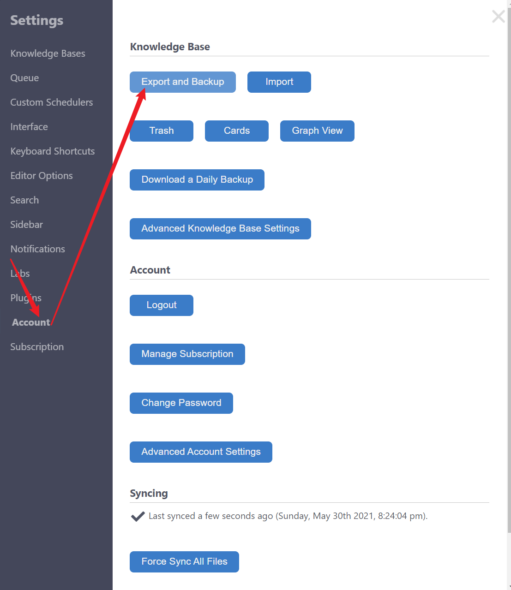
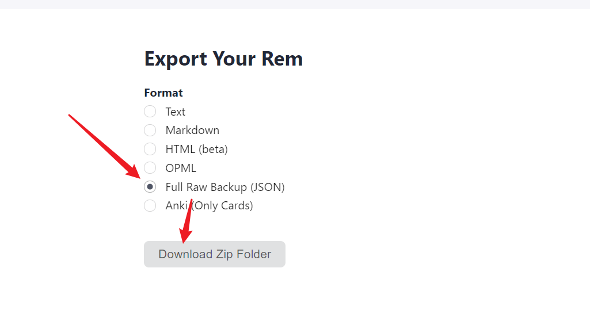
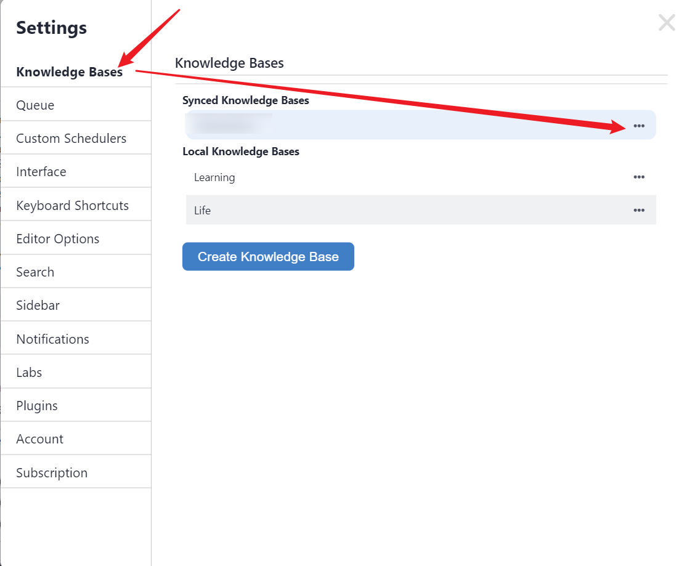
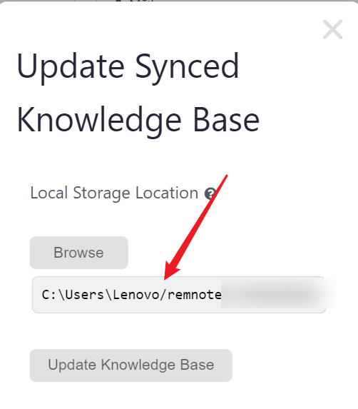
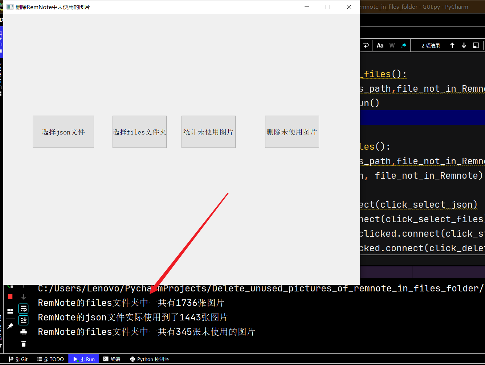

- https://user-images.githubusercontent.com/35528109/120111744-bbd51280-c1a5-11eb-9482-1201a8e7c510.mp4
- 背景与引言
  - 众所周知，RemNote保存图像的机制为：只要粘贴图片（或者其他文件）进RemNote中，就会在其数据库文件夹files下存入一张图片，即使当用户在RemNote删除了这张图片，files文件中的这张图片依然存在，随着用户笔记数量的增多，会导致files文件夹越来越大，里面存储了大量用户永远用不到的图片，不仅仅浪费了，对服务器同步造成了很大但是不必要的压力。因此，对RemNote中files数据库文件夹进行文件清理，势在必行!
- 材料与方法
  - 材料
    - RemNote的备份的json 文件
      - RemNote-Account-Export and Backup-选择导出为Full RAW Backup（JSON）格式
        - 
        - 
        - 
      - 之后将其解压，放到指定的文件夹下
    - files文件
      - RemNote的备份文件夹，一般位于C:\Users\Lenovo\remnote\xxx\files，可以通过
      - 
      - 
      - 
      - 
      - 查看具体路径
  - 使用方法
    - 使用的时候，从左向右，依次选择不同的按钮顺序执行即可：
    - 1.“选择json文件”
    - 2.“选择files文件夹”
    - 3.“统计未使用的图片”
      - 此时会弹出RemNote的files文件夹中一共有多少张图片、RemNote中一共使用了多少张图片，以及files文件夹下一共是有多少张图片未在RemNote中使用，
      - 
    - 4.“删除未使用的图片”
      - 确认信息无误后，执行”删除未使用的图片“即可将所有未使用到的图片和文件来删除。
- 讨论
  - 经测试，本方法在多个数据库上清理工作运行良好，尚未发现bug，但不排除有意外情况，因此建议在使用之前先备份所有的数据；
  - 如果有误删除的情况发生，还请通过issue反馈作者。
- 结论
  - 这个方法可以清除RemNote的files文件夹中不再使用的图像。但目前界面写得太素了，未来会对界面进行优化，以更加契合用户的需求。
  - （周末占用了本该用于写论文的时间，写RemNote的辅助代码与文档，此时此刻不禁内心愧疚，于是就用学术化的语言写一下使用方法，以抵消内心的愧疚之感，逃~）
  - 

